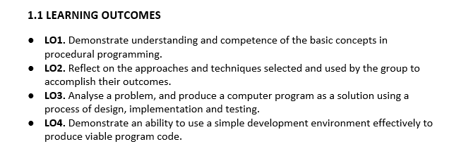
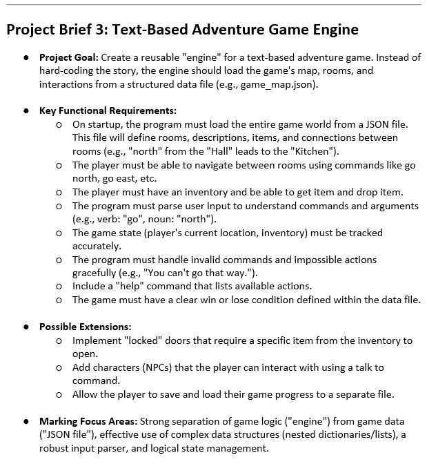
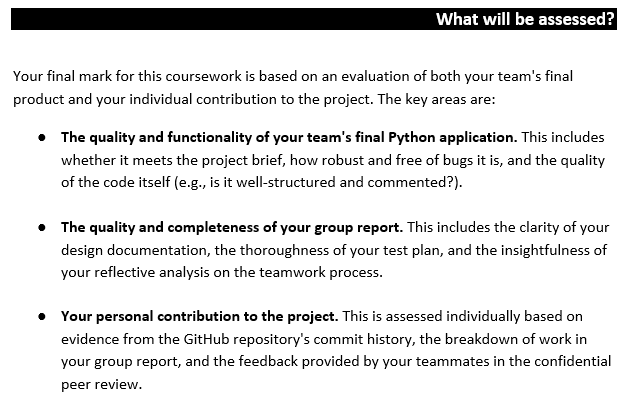

# Project-Overview

This document is used to "discuss" any problems or challenges, and states the goals that need to be achieved.

## Challenges

---

### Loading the game from a JSON file

This allows the game to be a lot more scalable and expandable.

This means that, programming a self generating map will be a bit more difficult however, but still possible.

We need to do a bit of research on JSON files; to understand the structure of the file.

